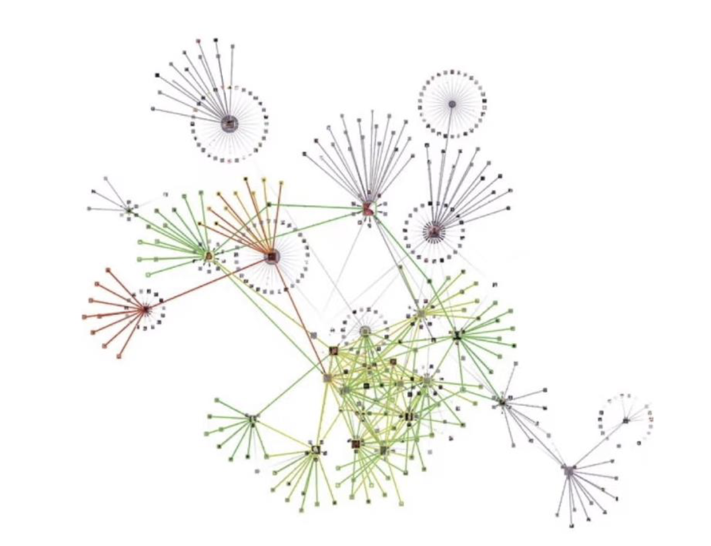

# Relatório Analítico – Análise de Redes

---


## 1. Distribuição de graus

**Pergunta:**  
Qual é a distribuição de graus de ambos os grafos? Essa distribuição apresenta características típicas de redes complexas?

**Resposta:**  
[Inserir texto explicativo]  
[Inserir histogramas e gráficos de distribuição]

---

## 2. Componentes conexas

**Pergunta:**  
Quantas componentes conexas (grafo não-direcionado) e fortemente conexas (grafo direcionado) existem? Qual a distribuição de ordem dessas componentes (número de vértices)? O que essa distribuição indica sobre as características do problema?

**Resposta:**  
[Inserir texto explicativo]  
[Inserir gráficos ou tabelas com os tamanhos das componentes]

---

## 3. Centralidade de grau (grafo direcionado)

**Pergunta:**  
Quais são os 10 diretores mais influentes perante a métrica de centralidade de grau? O que essa métrica representa nesse contexto?

**Resposta:**  
```python
dg_centrality = dg.degree_centrality(1) # 1 para indegree, 2 para outdegree, 0 para total degree
print("Top 10 diretores mais influentes(direcionado):") #diretores é indg devido as especificações do TDE
for node, value in sorted(dg_centrality.items(), key=lambda x: x[1], reverse=True)[:10]: # o que muda é o [:10] que limita a 10 os resultados
    print(f"{node} - {value:.4f}")
```

| Rank| Diretor             | $C_{\text{Grau}}^{\text{In}}$ |
| ---- | ------------------- | ----------------------------- |
| 1    | MARTIN SCORSESE     | 0.0021                        |
| 2    | STEVEN SPIELBERG    | 0.0021                        |
| 3    | JOSEPH KANE         | 0.0019                        |
| 4    | DON MICHAEL PAUL    | 0.0018                        |
| 5    | DIBAKAR BANERJEE    | 0.0016                        |
| 6    | STEVE BRILL         | 0.0016                        |
| 7    | ROBERT RODRIGUEZ    | 0.0016                        |
| 8    | CATHY GARCIA-MOLINA | 0.0016                        |
| 9    | PAUL HOEN           | 0.0015                        |
| 10   | RON HOWARD          | 0.0015                        |

Cada aresta aponta de um ator para o diretor que o dirigiu, esse é o motivo pelo qual somente o grau de entrada de um nó é puxado, para indicar quantos atores estiveram sob a direção desse diretor. (Se tem ao menos um, mesmo que o diretor tenha atuado em algum filme julguei que ele pode ser considerado um direc. Não é exclusivo ser um **ou** outro)

Diretores que tem a centralidade de grau maior conectam mais atores e comunidades de atores entre si, como se fosse um "dente-de-leão".



Na tabela se mostram os atores que tem maior grau e a imagem é uma representação das conexões de diretores.

---

## 4. Centralidade de intermediação (grafo direcionado)

**Pergunta:**  
Quais são os 10 diretores mais influentes perante a métrica de centralidade de intermediação? O que essa métrica representa nesse contexto?

**Resposta:**  
[Inserir texto explicativo]  
[Inserir tabela e gráfico]

---

## 5. Centralidade de proximidade (grafo direcionado)

**Pergunta:**  
Quais são os 10 diretores mais influentes perante a métrica de centralidade de proximidade? O que essa métrica representa nesse contexto?

**Resposta:**  
[Inserir texto explicativo]  
[Inserir tabela e gráfico]

---

## 6. Centralidade de grau (grafo não-direcionado)

**Pergunta:**  
Quais são os 10 atores/atrizes mais influentes perante a métrica de centralidade de grau? O que essa métrica representa nesse contexto?

**Resposta:**  
```python
print("Top 10 diretores/atores mais influentes(nao direcionado):")
for node, value in sorted(udg_centrality.items(), key=lambda x: x[1], reverse=True)[:10]:
    print(f"{node} - {value:.4f}")
```
| Rank | Ator       | $C_{\text{Grau}}$ |
| ---- | ----------------- | ----------------- |
| 1    | ANUPAM KHER       | 0.0076            |
| 2    | DANNY TREJO       | 0.0056            |
| 3    | AMITABH BACHCHAN  | 0.0053            |
| 4    | PARESH RAWAL      | 0.0052            |
| 5    | MORGAN FREEMAN    | 0.0051            |
| 6    | JOHN GOODMAN      | 0.0051            |
| 7    | SAMUEL L. JACKSON | 0.0050            |
| 8    | PAUL GIAMATTI     | 0.0048            |
| 9    | FRED ARMISEN      | 0.0047            |
| 10   | SHAH RUKH KHAN    | 0.0047            |

Toda vez que dois atores atuam no mesmo título e é uma participação em conjunto a aresta é gerada.
A centralidade é calculada e normalizada com base nos cálculos apresentados nos slides da semana 14.


Os atores com valores altos, são considerado o centro do grafo, em que se é possível conectar muitos artistas de diferentes segmentos, essa lista revela quem seria o possível "contato" a se ter para conseguir uma possível recomendação em um projeto.

Na tabela se mostram os atores que tem maior grau.


---

## 7. Centralidade de intermediação (grafo não-direcionado)

**Pergunta:**  
Quais são os 10 atores/atrizes mais influentes perante a métrica de centralidade de intermediação? O que essa métrica representa nesse contexto?

**Resposta:**  
[Inserir texto explicativo]  
[Inserir tabela e gráfico]

---

## 8. Centralidade de proximidade (grafo não-direcionado)

**Pergunta:**  
Quais são os 10 atores/atrizes mais influentes perante a métrica de centralidade de proximidade? O que essa métrica representa nesse contexto?

**Resposta:**  
Mede o quão próximo cada ator está de todos os outros no grafo de colaborações, medindo o número mínimo de elencos em comum necessários para conectar-lo a qualquer colega. 

Rank	Ator	   Proximidade
1	Ben Kingsley	0.2213398
2	Willem Dafoe	0.2208615
3	Alfred Molina	0.2199867
4	Robert Patrick	0.2192756
5	Michael Madsen	0.2182952
6	Helen Mirren	0.2179878
7	Gerard Butler	0.2174946
8	James Franco	0.2170819
9	Bradley Cooper	0.2170004
10	Nicolas Cage	0.2169805

---
